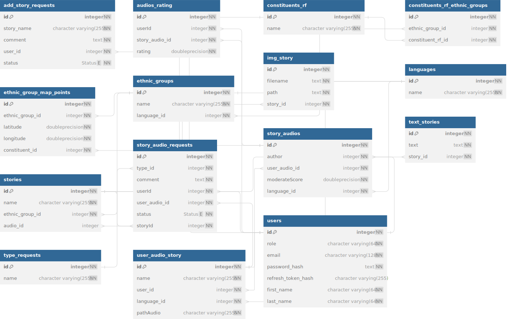

## Description

Проект представляет собой интерактивный веб-сайт, на котором размещена карта России. Пользователь может выбрать регион, а затем этническую группу и язык, чтобы прослушать сказку, соответствующую этой группе.

## Архитектура приложения

1. Точка входа (src/main.ts)
   - Инициализация приложения NestJS
   - Настройка глобальных middleware и фильтров
   - Конфигурация CORS
   - Настройка WebSocket через SocketIOAdapter
   - Интеграция Swagger
   - Настройка валидации через ValidationPipe
   - Глобальные фильтры ошибок (HttpErrorFilter, PrismaErrorFilter)
2. Корневой модуль (src/app/app.module.ts)

   - Центральная точка конфигурации приложения
   - Импорт всех модулей системы
   - Настройка ConfigModule с валидацией переменных окружения
   - Статическая раздача файлов через ServeStaticModule
   - Интеграция PrismaModule для работы с базой данных

3. Приложение состоит из модульной структуры `(src/app/modules/)`

   a. Аутентификация и авторизация

   - `auth/` - управление аутентификацией
   - `user/` - управление пользователями
   - `admin/` - административные функции

   b. Основной функционал

   - `map/` - работа с картой
   - `story/` - управление сказками
   - `ethnic-group/` - управление этническими группами
   - `constituent/` - управление субъектами карты

   c. Заявки пользователей и аудио

   - `request/` - управление заявками
   - `user-audio/` - управление аудиозаписями пользователей
   - `audio-story-request/` - управление заявками для аудиозаписей
   - `add-story-request/` - управлени заявками на добавление сказок

4. Инфраструктурный слой
   - `config/` - конфигурационные файлы
     - app.config.ts - основные настройки приложения
     - swagger.config.ts - конфигурация Swagger
     - prisma.config.ts - настройки Prisma
     - jwt.config.ts - конфигурация JWT
     - uploads.config.ts - настройки загрузки файлов
   - `common/` - общие компоненты
     - Фильтры для обработки ошибок
     - Фабрики исключений
     - Общие утилиты
   - `shared/`
     - WebSocket адаптеры
     - Общие интерфейсы
     - Утилиты
   - `prisma/` - ORM слой
     - Схемы базы данных
     - Миграции
     - Сервисы доступа к данным

В приложении присутствуют следующие технические особенности:

- WebSocket интеграция для real-time функционала
- Валидация данных на уровне DTO
- Глобальная обработка ошибок
- Статическая раздача файлов
- CORS настройки - Swagger документация API

## Схема базы данных



## Описание схемы

1. `User` (Пользователь) - хранит информацию о пользователях системы с различными ролями (обычный пользователь, модератор, администратор). Пользователи могут создавать аудиозаписи историй, оценивать их и отправлять заявки.
2. `EthnicGroup` (Этническая группа) - представляет различные этнические группы, каждая из которых связана с определенным языком и может располагаться в разных субъектах РФ.
3. `ConstituentsRF` (Субъекты РФ) – субъекты на карте России, в которых проживают представители этнических групп.
4. `Language` (Языкы) - языки, на которых говорят этнические группы и на которых записаны аудиофайлы.
5. `Story` (Сказки) – сказки народов, связанные с конкретными этническими группами. Могут иметь текстовую версию и аудио, а также могут иметь обложки.
6. `StoryAudio` (Аудиозапись истории) - профессиональные аудиозаписи историй, созданные на основе пользовательских загрузок и проверенные модераторами.
7. `UserAudioStory` (Пользовательская аудиозапись) - аудиофайлы, загруженные пользователями в систему.
8. `TextStory` – хранит текст сказок.
9. `ImgStory` – хранит местоположение обложек для сказок.
10. EthnicGroupMapPoint - координаты точек, где расположены этнические группы.
11. `ConstituentsRFOnEthnicGroup` - связующая таблица между субъектами РФ и этническими группами.
12. `RatingAudio` - оценки аудиозаписей пользователями.
13. `AddStoryRequest` - заявки на добавление новых историй.
14. `StoryAudioRequest` - заявки от пользователей на добавление аудиозаписей к сказке.

## Swagger

`http://localhost:3000/api`

## Настройка

### путь хранения обложек для сказок

- `src\static\uploads\img\{storyId}\{fileName}`

### путь хранения озвучек для сказок

- `src\static\uploads\audio\{userId}\{languageId}\{fileName}`

## Установка и запуск

```bash
$ npm install
```

## Running the app

```bash
# development
$ npm run start

# watch mode
$ npm run start:dev

# production mode
$ npm run start:prod
```

## Test

```bash
# unit tests
$ npm run test

# e2e tests
$ npm run test:e2e

# test coverage
$ npm run test:cov
```
