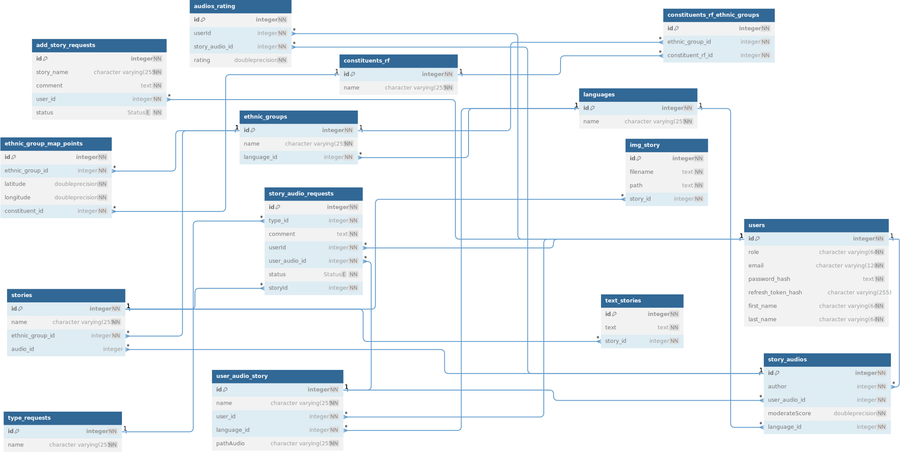

## Description

Проект представляет собой интерактивный веб-сайт, на котором размещена карта России. Пользователь может выбрать регион, а затем этническую группу и язык, чтобы прослушать сказку, соответствующую этой группе.

## Схема базы данных



## Swagger

`http://localhost:3000/api`

## Настройка

### путь хранения обложек для сказок

- `src\static\uploads\img\{storyId}\{fileName}`

### путь хранения озвучек для сказок

- `src\static\uploads\audio\{userId}\{languageId}\{fileName}`

## Установка и запуск

```bash
$ npm install
```

## Running the app

```bash
# development
$ npm run start

# watch mode
$ npm run start:dev

# production mode
$ npm run start:prod
```

## Test

```bash
# unit tests
$ npm run test

# e2e tests
$ npm run test:e2e

# test coverage
$ npm run test:cov
```
